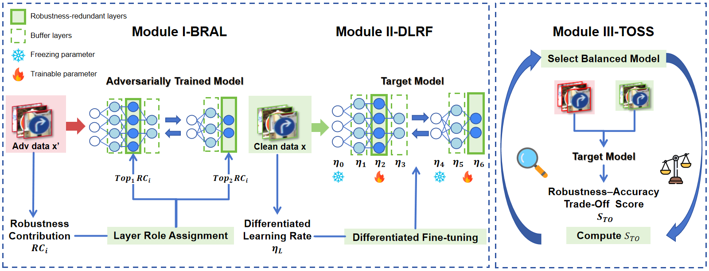

# Buffer-Guided Differentiated Learning for Adversarial Fine-Tuning in Self-Supervised Pretrained Models
This is the official implementation of IJCNN2026 Buffer-Guided Differentiated Learning for Adversarial Fine-Tuning in Self-Supervised Pretrained Models.

## Abstract:


## Requirements
- **Build environment**
```shell
cd BDAF
# use anaconda to build environment 
conda create -n BDAF python=3.8
conda activate BDAF
# install packages
pip install -r requirements.txt

```
- **The final project should be like this:**
    ```shell
    BDAF
    └- main
        └- model
            └- linear.py
        └- utils
            └- drc.py
            └- ...
        └- victims
            └- cifar10 
                └- byol
                    └- byol-cifar10-32brzx9a-ep=999.ckpt
                    └- args.json
        └- attack model
            └- AdvEncoder.py
        └- adversarial_fine-tuning.py
        └- standard_finetuning.py
    └- Dataset
        └- ANIMALS10
        └- cifar10
        └- GTSRB
        └- cifar10
    └- AdvEncoder

- **Download victim pre-trained encoders**
  - All of our pre-trained encoders were obtained from the [solo-learn](https://github.com/vturrisi/solo-learn)  repository.
  - Please move the downloaded pre-trained encoder into  /victims/[pre-dataset]/[method].

- **Demo**
-./run_finetuning.sh
-./attack_test.sh
